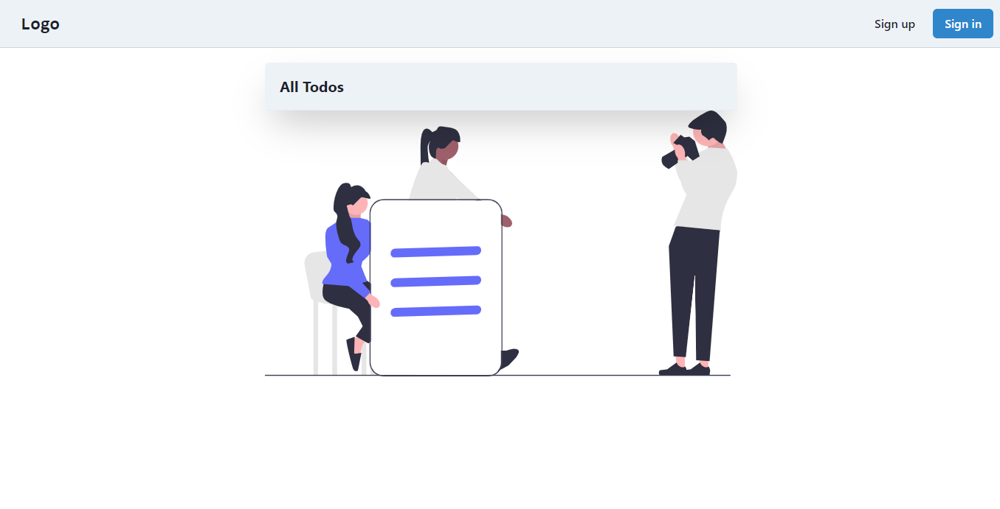
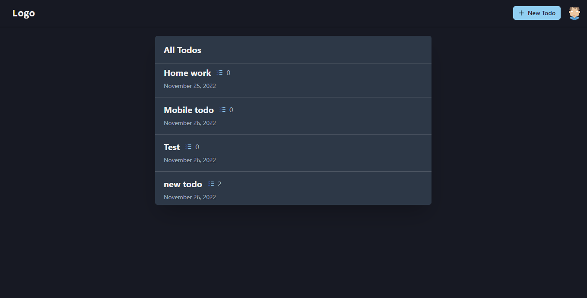
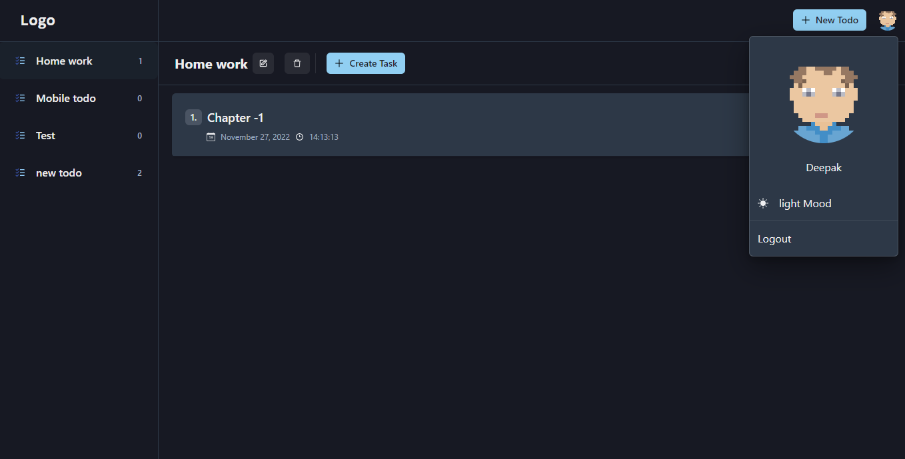

## Todo App (ligth and dark mood)

[Click to check out](https://todofriend.netlify.app/)

## Useges Technology :

```
Reactjs, Nodejs, Mongodb, Chakra ui, Git, Jsonwebtoken, express-validator, React-toastify More.....

Local storage , Cookie

```

**It is a todo app. User can create a todo, and inside the todo user can create tasks and Each task can be moved and updated.**

### Light and dark both themes are available. After created a todo user automatically redirected inside todo where user can create tasks, remove task, update task and get task .This app also mobile friendly

[Click to check out](https://todofriend.netlify.app/)

Preview




## Hope you like this app. If you like it, let me know on my Instagram [instagram](https://www.instagram.com/coder_deepak/)
